# **Active Directory Lab 2 – User Management (Create, Reset, Disable/Delete)**

## 💑 **Table of Contents**
- [Description](#description)
- [Tools and Technologies Used](#tools-and-technologies-used)
- [Environment](#environment)
- [Task Instructions](#task-instructions)
- [My Configuration Steps](#my-configuration-steps)
  - [Part 1 - Creating a User in Active Directory](#part-1---creating-a-user-in-active-directory)
  - [Part 2 - Resetting a User’s Password](#part-2---resetting-a-users-password)
  - [Part 3 - Disabling and Deleting a User Account](#part-3---disabling-and-deleting-a-user-account)
- [Conclusion](#conclusion)

---

## **Description**
This lab demonstrates **Active Directory user management operations** including:  
1. Creating an organizational unit (OU) and adding a new user.  
2. Resetting a user’s password in response to a support request.  
3. Disabling and deleting a user account based on workplace account lifecycle policies.  

These are core skills for system administrators managing users in an Active Directory environment.  

---

## **Tools and Technologies Used**
- **Windows Server 2016 Datacenter (Domain Controller)**  
- **Windows 10 Pro (Client VM)**  
- **Oracle VirtualBox** (Virtualization)  
- **Active Directory Users and Computers (ADUC)**  

---

## **Environment**
- **Domain Name**: `WinAc.com`  
- **Organizational Units Created**:  
  - `Domain Users`  
  - `Domain Computers`  
  - `Disabled Users`  
- **Test User**: `Max Law` (`max.law@WinAc.com`)  

---

## **Task Instructions**
1. Create a new **Organizational Unit (OU)** for domain users and computers.  
2. Add a new user (`Max Law`) and verify login on a client machine.  
3. Simulate a **password reset request** from the user.  
4. Implement **disable and delete** workflows for user account lifecycle management.  

---

## **My Configuration Steps**

### **Part 1 - Creating a User in Active Directory**

- Created a new OU structure inside `WinAc` for better organization:  
  - `Domain Users`  
  - `Domain Computers`  

**Screenshot – Creating a new OU:**  
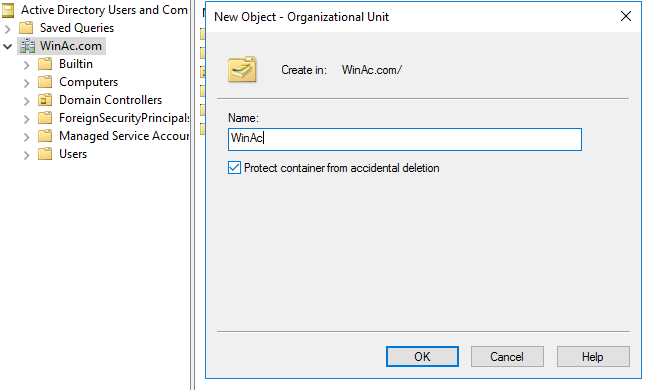

**Screenshot – OU structure:**  
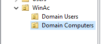

- Created a new user `Max Law` inside the `Domain Users` OU.  

**Screenshot – User details creation:**  
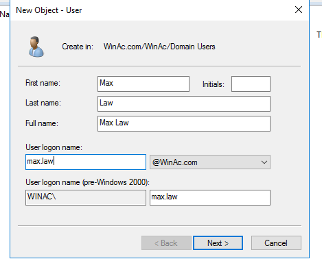

**Screenshot – Setting password for new user:**  
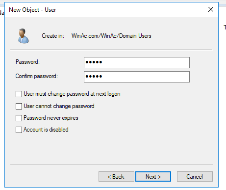

- Verified that the user appeared in the `Domain Users` container.  

**Screenshot – User listed in ADUC:**  
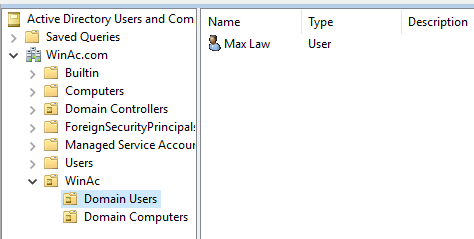

- Logged into the Windows 10 client as the new user (`max.law`).  

**Screenshot – Logging in with new user:**  
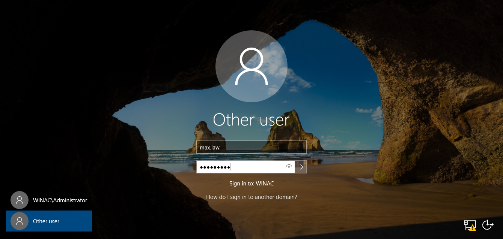

**Screenshot – Successful login:**  
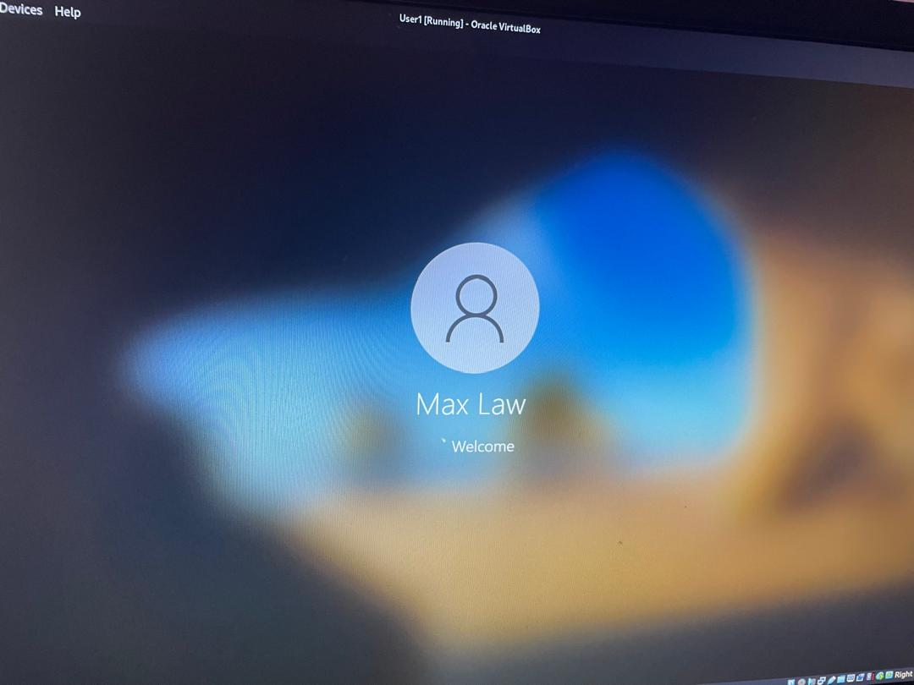

---

### **Part 2 - Resetting a User’s Password**

Scenario: A user complains they cannot log into their machine. As an administrator:  
1. First validate identity by asking the user for **full name** and **username**.  
2. Search for the user in ADUC to confirm account details.  
3. Reset password to a **temporary password**, with option “User must change password at next logon.”  
4. Have the user log in and change password immediately.  

**Screenshot – Searching for user in ADUC:**  
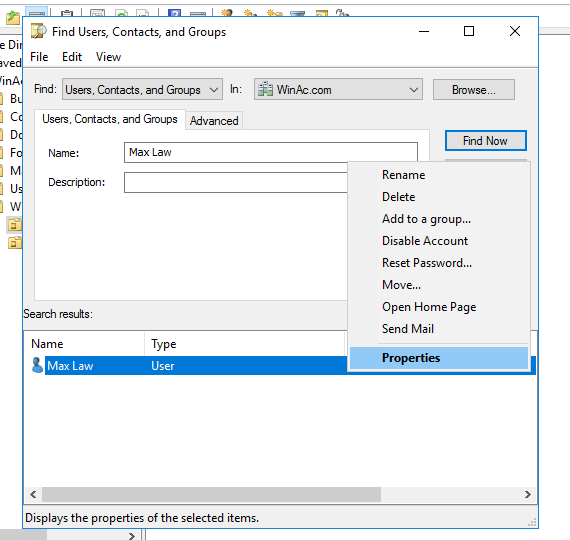

**Screenshot – User account properties:**  
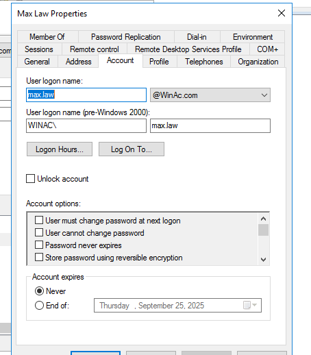

**Screenshot – Resetting password with temporary value:**  
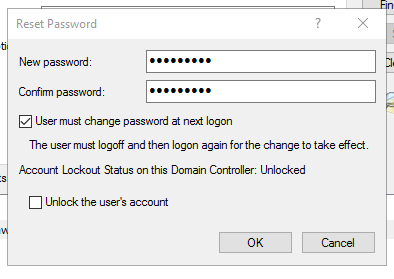

- User logs in with the temporary password and is forced to change it.  

**Screenshot – User prompted to change password at login:**  
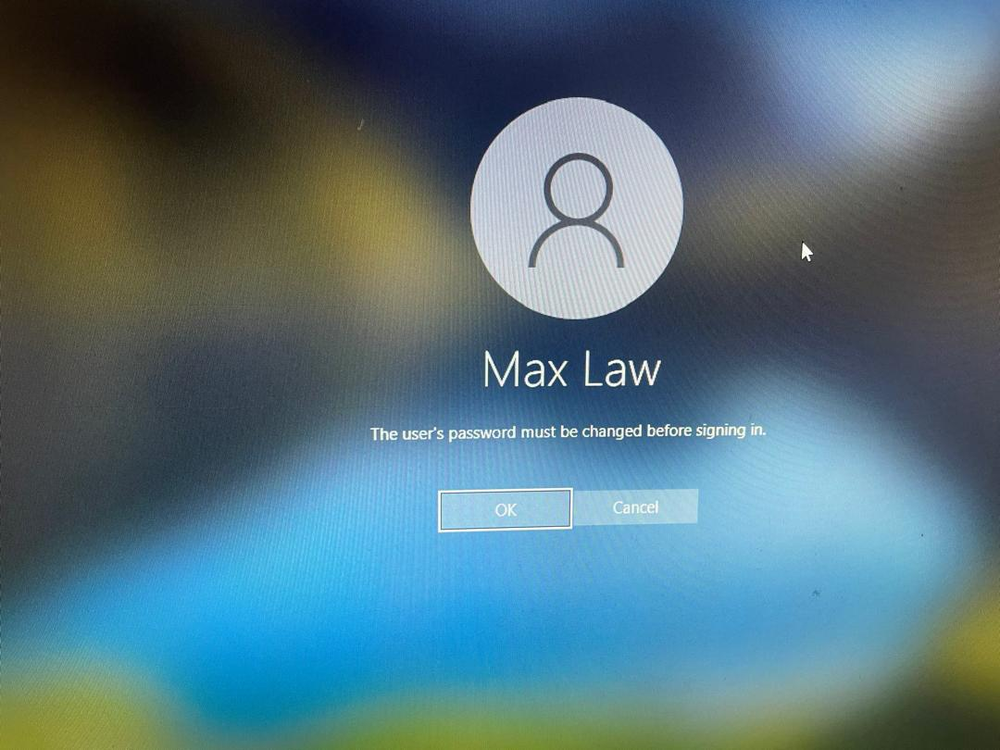

**Screenshot – Password must be changed before login:**  

---

### **Part 3 - Disabling and Deleting a User Account**

Policy simulated: When a user leaves the organization, their account should first be **disabled** and moved into a `Disabled Users` OU for 30 days before deletion.  

- Created an OU named `Disabled Users`.  

**Screenshot – Creating Disabled Users OU:**  
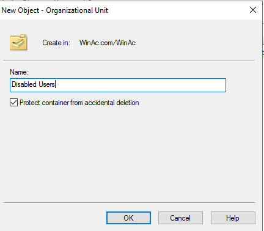

- Disabled the account `Max Law`.  

**Screenshot – Disable account action:**  
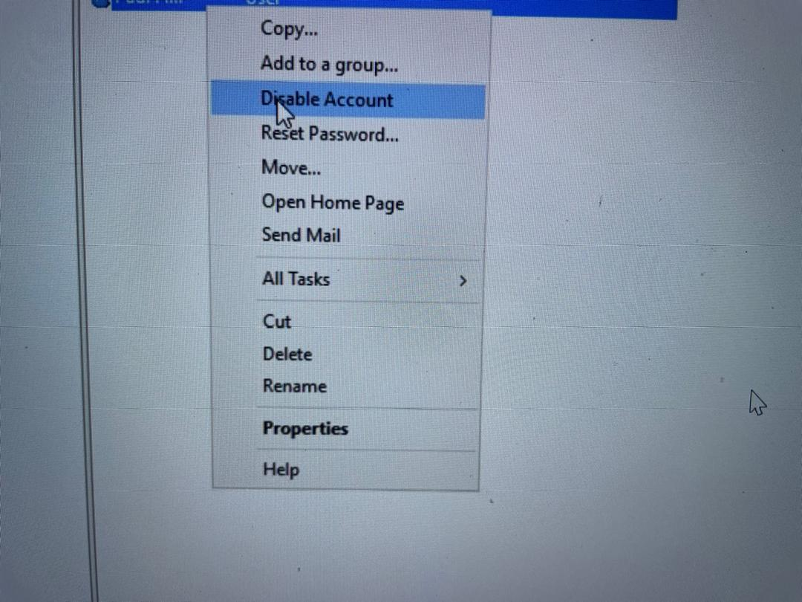

**Screenshot – Confirmation that user has been disabled:**  
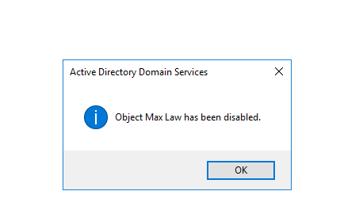

- Attempted login with disabled account → login blocked.  

**Screenshot – Disabled login attempt:**  
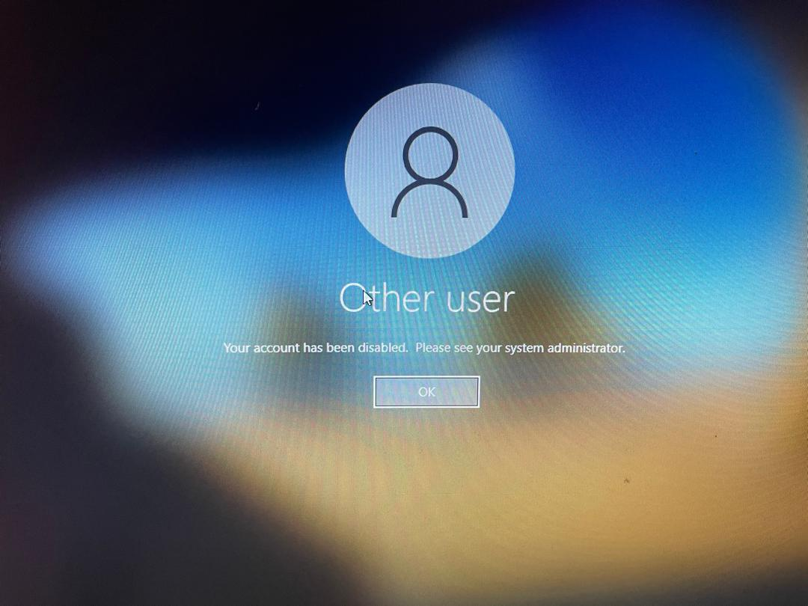

- Finally, deleted the user account from ADUC.  

**Screenshot – Deleting user account:**  
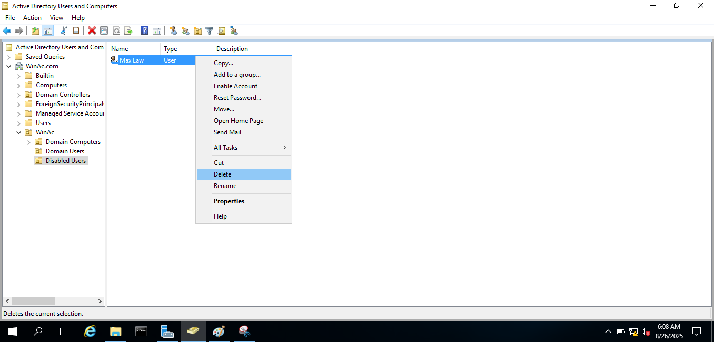

---

## ✅ **Conclusion**
This lab successfully demonstrates core **Active Directory user management tasks**:  
- Creating OUs for structured management.  
- Adding a new domain user and verifying login.  
- Resetting user passwords with proper verification.  
- Implementing account disable and delete workflows aligned with workplace policies.  

These steps represent real-world AD administration practices for handling the user account lifecycle.  
