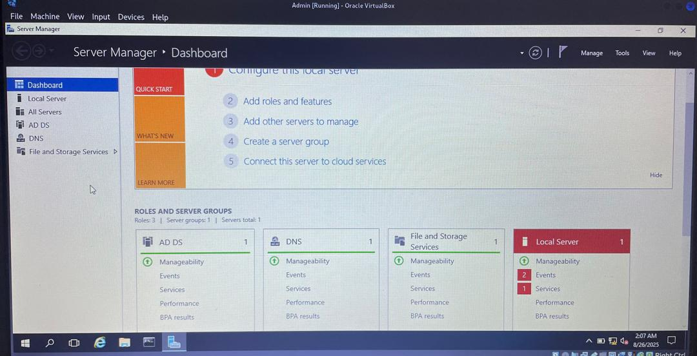
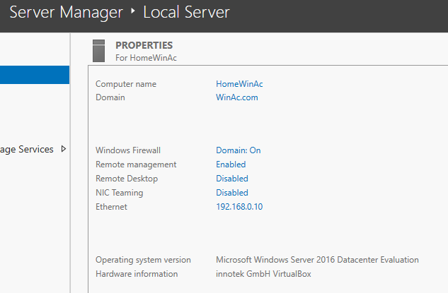
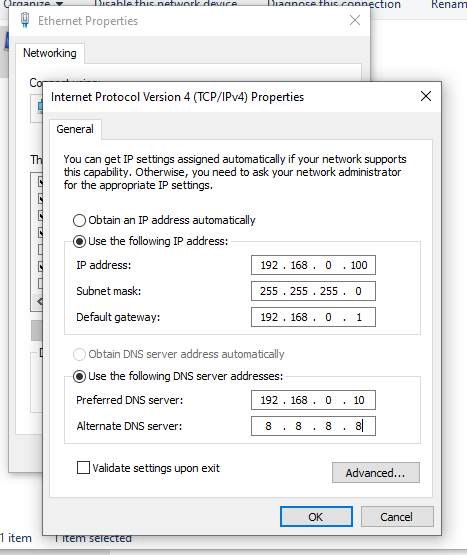
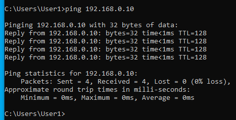
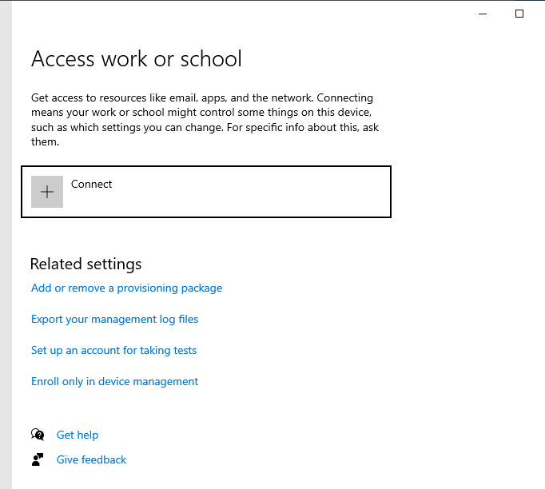
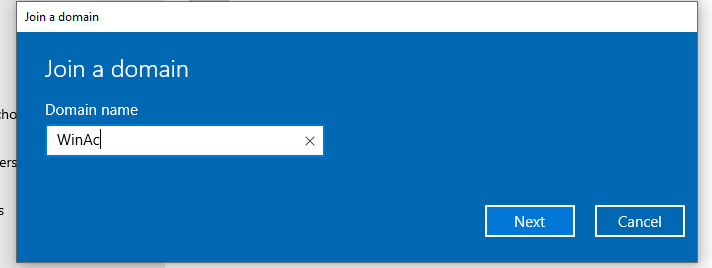
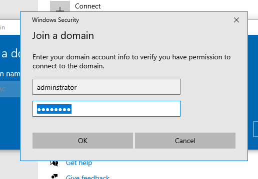
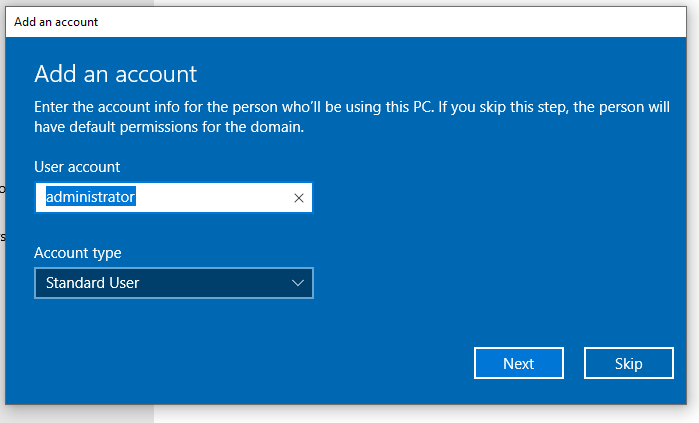
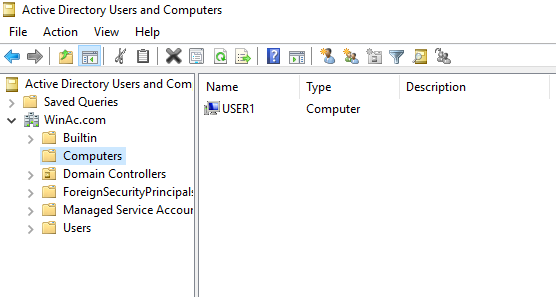

# **Active Directory Lab 1 – Join Windows 10 Client to AD Domain**

## 💑 **Table of Contents**
- [Description](#description)
- [Tools and Technologies Used](#tools-and-technologies-used)
- [Environment](#environment)
- [Initial Topology](#initial-topology)
- [Task Instructions](#task-instructions)
- [My Configuration Steps](#my-configuration-steps)
  - [Part 1 - Setup and Configure Domain Controller](#part-1---setup-and-configure-domain-controller)
  - [Part 2 - Configure Windows 10 Client Network Settings](#part-2---configure-windows-10-client-network-settings)
  - [Part 3 - Domain Join Process](#part-3---domain-join-process)
- [Conclusion](#conclusion)

---

## **Description**
This lab focuses on **setting up a basic Active Directory (AD) environment** using Windows Server 2016 as a **Domain Controller (DC)** and joining a Windows 10 client machine to the domain.  

The objective is to demonstrate:
- Installing and configuring AD DS and DNS on the server  
- Setting up static IP addresses for server and client  
- Successfully joining the client PC (`USER1`) to the domain `WinAc.com`  
- Verifying the client’s registration in **Active Directory Users and Computers (ADUC)**  

---

## **Tools and Technologies Used**
- **Windows Server 2016 Datacenter (Evaluation)**  
- **Windows 10 Pro (Client VM)**  
- **Oracle VirtualBox** (Virtualization)  
- **Active Directory Domain Services (AD DS)**  
- **Domain Name System (DNS)**  

---

## **Environment**
- **Server (Domain Controller)**  
  - Computer Name: `HomeWinAc`  
  - Domain: `WinAc.com`  
  - IP Address: `192.168.0.10`  
  - Roles: AD DS, DNS  

- **Client (Windows 10)**  
  - Computer Name: `USER1`  
  - IP Address: `192.168.0.100`  
  - Gateway: `192.168.0.1`  
  - DNS: `192.168.0.10` (DC), `8.8.8.8` (secondary)  

---

## **Initial Topology**
```
[ Windows Server 2016 (HomeWinAc) ]
      |   (192.168.0.10)
      |
[ Windows 10 Client (USER1) ]
      |   (192.168.0.100)
```

---

## **Task Instructions**
1. Set up a Windows Server 2016 VM as a Domain Controller with AD DS and DNS.  
2. Configure static IP addressing on both server and client.  
3. Ensure network connectivity between the server and client.  
4. Join the Windows 10 client (`USER1`) to the `WinAc.com` domain.  
5. Verify successful domain join using ADUC.  

---

## **My Configuration Steps**

### **Part 1 - Setup and Configure Domain Controller**
- Installed **Active Directory Domain Services (AD DS)** and **DNS**.  
- Renamed server to `HomeWinAc`.  
- Promoted it to a **Domain Controller** with domain `WinAc.com`.  

**Screenshot – Server Manager Dashboard with AD DS, DNS, and File Services installed:**  


**Screenshot – Local Server properties (showing domain info):**  


---

### **Part 2 - Configure Windows 10 Client Network Settings**
- Set a static IP: `192.168.0.100`.  
- Subnet mask: `255.255.255.0`.  
- Default Gateway: `192.168.0.1`.  
- Preferred DNS: `192.168.0.10` (DC).  
- Alternate DNS: `8.8.8.8`.  

**Screenshot – IP Configuration (IPv4 settings):**  


- Verified connectivity using **ping** to the DC (successful one-way due to firewall rules).  

**Screenshot – Successful ping from USER1 to DC:**  


---

### **Part 3 - Domain Join Process**
- On USER1, navigated to **Access work or school → Connect → Join this device to a local Active Directory domain**.  

**Screenshot – Access work or school settings:**  


- Entered domain name: `WinAc.com`.  

**Screenshot – Domain join prompt:**  


- Authenticated using `administrator` domain credentials.  

**Screenshot – Domain credentials authentication:**  


- Added account permissions for the domain user.  

**Screenshot – Adding account permissions:**  


- USER1 was successfully joined to the domain.  
- After reboot, the client allowed login with domain credentials.  

**Screenshot – ADUC Console showing USER1 listed under Computers:**  


---

## ✅ **Conclusion**
This lab successfully demonstrates:  
- Setting up a Windows Server 2016 Domain Controller.  
- Configuring a Windows 10 client with proper IP/DNS settings.  
- Joining the client (`USER1`) to the Active Directory domain `WinAc.com`.  
- Verifying domain membership in Active Directory Users and Computers.  

